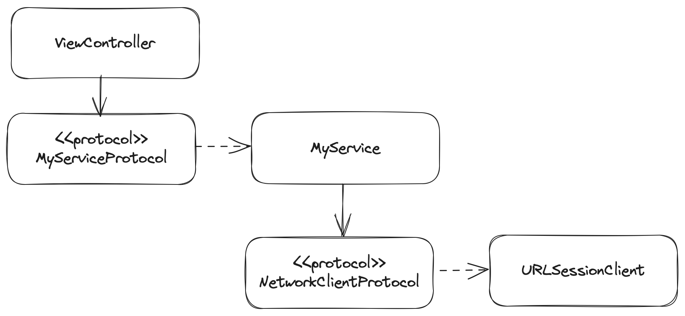

# UIKit Simple Network Architecture

This project showcases how to implement a simple network architecture based on services and reusable network client. It relies on protocols and could be used to start a new UIKit project.

